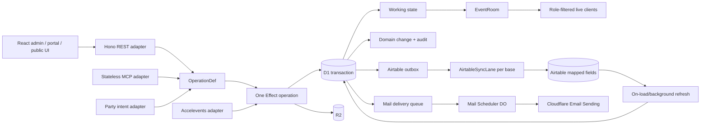
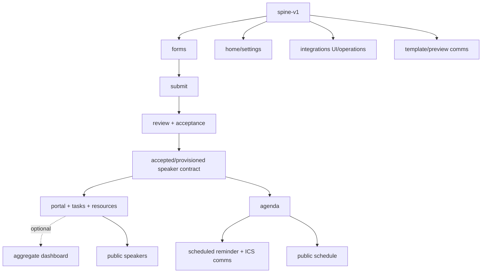

# session-party — Execution Plan

Open-source Sessionboard replacement for the “Kill My SaaS” competition.

- Deadline: **Wednesday, August 12, 10 PM PT**
- Evaluation: nine brief feature areas, a deployed testable site and walkthrough, and real use by non-technical event-production staff; the aggregate onboarding dashboard is explicitly best-effort
- Product direction: Sessionboard capabilities with Luma’s calm, event-first public UX and a denser operations cockpit
- Authority: **the user is final authority**; Main coordinates and recommends; Sol, Ops, advisors, and subagents are advisory or scoped executors
- Current scope: local implementation is authorized; external provisioning, migration, deployment, secrets, routes, DNS, and production promotion remain separately gated

## Outcome

A usable event-production system in which organizers can collect routed proposals, review and accept them, onboard speakers through tasks/resources/uploads, build a conflict-free agenda, deliver scheduled personalized mail and calendar invites, import Accelevents data without re-entry, and publish mobile speaker/schedule outputs. Airtable synchronization is bonus scope.

The primary interface is the admin UI. MCP is a thin test/automation transport and bonus—not a substitute for the organizer experience.

### Brief-first priority

The release critical path is the observable workflow, not route count:

1. conditional/routed CFP
2. multi-round review and acceptance
3. one coherent speaker portal for submissions, profile, tasks, task-linked forms, headshot, slides, supporting documents, and resource/wiki pages
4. agenda conflict resolution with list/day/week/track/room views
5. scheduled personalized text/HTML reminders with a confirmed-agenda `.ics` attachment that reaches the speaker's calendar
6. mobile public speaker gallery and published schedule
7. idempotent one-way Accelevents import through the production adapter interface

The aggregate onboarding dashboard and admin CMS/embed builder are best-effort polish. Task status remains required in the portal and organizer task workflow. Airtable synchronization remains bonus scope. A route, configuration form, or truthful placeholder does not satisfy a workflow by itself.

## Locked decisions

| Area | Decision |
|---|---|
| Language | TypeScript |
| Server programming model | **Effect v3**: Schema at every ingress/egress, tagged errors, Layer-provided capabilities, one runtime boundary |
| Runtime | One Cloudflare Worker application |
| Frontend | React 19 + Vite + Cloudflare Vite plugin |
| HTTP API | Hono at `/api/v1` |
| MCP | Streamable HTTP at `/mcp`; event-scoped API keys only; `tools/list` is filtered to the key's exact scopes and exposes curated organizer/integration workflows rather than every REST operation |
| Wire contracts | **camelCase** across REST, MCP, OpenAPI, and realtime (user-locked) |
| Legacy credentials | Upgrade preserves users/events/members but revokes incompatible bearer tokens and API keys; migration never fabricates HMAC hashes, roles, scopes, creators, or expiry |
| Realtime | PartyServer/Durable Objects; one coordination room per event with role-filtered delivery |
| Realtime recovery | Party messages are post-commit hints/acks, not a replay source. Live delivery is audience-filtered; reconnect/gap recovery refetches canonical state through authorized REST. P0 advertises no cursor or Party replay API |
| Realtime audiences | Rooms admit only event-member `owner`/`admin`/`reviewer` or exact event-scoped API-key scopes. Presence excludes API-key identities; `review`/`submissions` target organizer+reviewer readers, `dashboard` targets organizer readers, agenda targets agenda readers, and errors are direct replies |
| Agenda realtime commands | Clean pre-`spine-v1` cutover: EventRoom derives event/principal; mutation messages carry request/idempotency/version and complete command state; success/error replies correlate by `replyTo` |
| Working database | D1 + Drizzle |
| Airtable bonus authority | **Field-scoped if enabled:** every mapped field is declared Airtable-authoritative or D1-authoritative; there is no global winner |
| D1 role | Fast transactional working copy, pending-edit overlay, outbox/event log, and read cache; D1 owns app workflow fields unless explicitly mapped |
| Agenda publication | Latest immutable `domainChanges` snapshot (`agenda-publication` / event ID / `agenda/published`) is the P0 public projection; payload is validated and contains only confirmed scheduled talks plus visible speaker data |
| Files | R2 |
| Scheduling | Native Durable Object alarms through `Scheduler`; no `partywhen` dependency |
| Email | Cloudflare Workers Email Sending through the `EMAIL` binding, authorized sender `welcome@sessionparty.com`, plus generated `.ics` attachments |
| Mail execution | `MailQueue` supplies the configured immutable sender and best-effort post-commit wake of the canonical `Scheduler` object named `mail`; wake failure never rolls back the durable outbox and the alarm loop remains recovery. Scheduler sends the immutable snapshot exactly—recipient, configured sender/reply-to, subject, rendered HTML and text, base64-encoded ICS filename/content—and never reconstructs mutable template/event state. Cloudflare controls RFC `Message-ID` and rejects attempts to set it, so the adapter carries a stable SHA-256-derived `X-Session-Party-Delivery-ID` only as non-secret correlation metadata. Cloudflare's returned `EmailSendResult.messageId` is persisted separately as the provider message ID |
| Magic-link delivery | One D1 transaction commits user/token plus immutable mail snapshot/delivery; Scheduler performs the provider call after commit. A partial uniqueness invariant permits one unconsumed magic link per user; valid duplicate requests return the same generic response without extra mail, expired replacement invalidates/cancels the old delivery, raw tokens never enter logs/responses, and provider failures retain retry/dead-letter evidence |
| Magic-link verification | Conditional session creation and one-time token consumption commit atomically; the session cookie is emitted only after commit, and concurrent replay creates no second session |
| AI | Workers AI for optional, labeled, non-authoritative review assistance |
| Form semantic roles | Draft and immutable form fields carry optional `semanticKey`: `submissionTitle`, `submissionAbstract`, `speakerName`, or `speakerEmail`; keys are unique per form/version, and primary CFP publication requires exactly one title and abstract key |
| Legacy form semantics | Upgrade migration preserves legacy semantic keys as `null`; it never guesses from labels. Historical data stays readable, but explicit organizer assignment is required before republish/new submit-review activation |
| AI review identity | AI suggestions are `reviews` rows with `ai=true` and no reviewer; only a separate human-authored row enters human evidence. Event-scoped MCP/API keys may request labeled AI suggestions with `reviews:write`, but never human-score, accept, or act on behalf of a reviewer |
| Internal contention records | `forms.primaryClaim` and `forms.versionClaim` are approved internal-only `domainChanges` records committed atomically with idempotency/audit evidence; they are not semantic operation emits and are never broadcast |
| Cloudflare account | `jpoehnelt` (`9cfedefc6185f3dad8ab91241b401135`) |
| Airtable bonus target | Base `apphFjgebe5pq9gez`; initial table `tblA29jIMOPD42pDj`; optional view `viwsCbJ68dks4nb0s` |
| Airtable bonus topology | Three entity tables: `Speakers`, `Submissions`, `Talks`; all other entities deferred |
| Required integration | Idempotent one-way Accelevents import is P0. The deterministic demo uses the production adapter interface; live credentials are optional enhanced proof |
| Status cadence | Paseo heartbeat every 30 minutes through August 13 |

## Architecture



### One operation, three transports

Every command/query exists once as an `OperationDef`:

```ts
interface OperationDef<Input, EncodedInput, Output, EncodedOutput, Requirements> {
  readonly id: `${string}.${string}`
  readonly kind: "query" | "command"
  readonly input: Schema.Schema<Input, EncodedInput, never>
  readonly output: Schema.Schema<Output, EncodedOutput, never>
  readonly authorize: AuthorizationPolicy
  readonly invoke: (
    input: Input,
  ) => Effect.Effect<Output, AppError, Requirements>
  readonly rest?: { method: HttpMethod; path: string; input: InputLocations }
  readonly mcp?: { name: string; description: string }
  readonly party?: { intentType: `${string}/${string}` }
  readonly idempotency: "required" | "optional" | "none"
  readonly concurrency: "required" | "none"
  readonly emits: readonly EventType[]
}
```

Code generation projects this registry into:

- Hono routes
- explicitly selected, API-key-compatible MCP tools and JSON Schema
- OpenAPI 3.1
- Party intent dispatch
- collision/ownership manifest

Adapters only decode, authorize, invoke, encode, and map errors. They never contain business rules or direct Drizzle writes.

### Canonical Effect rules

1. Public domain functions return `Effect.Effect<A, AppError, R>` with the smallest capability set.
2. `effect/Schema` decodes inputs and encodes outputs. Output encoding failure is a defect, not client validation.
3. Services are `Context.Tag` capabilities: `Db`, `Mail`, `Files`, `Rooms`, `Ai`, `AirtableAdapter`, `Clock`, `IdGenerator`, `CurrentUser`.
4. `AppLayer(env)` provides infrastructure; `CurrentUser` is a per-invocation Layer.
5. Only `src/server/adapt.ts` may call `Effect.runPromiseExit`.
6. Drizzle/D1 transaction callbacks are bounded async islands: awaited DB work only; no nested Effect runner or external call.
7. External adapters consume `AbortSignal` and use per-attempt timeouts. Automatic retries require proven idempotency unless the documented operation contract is at-least-once: mail delivery may retry after an ambiguous crash window, reusing stable correlation metadata while recording every logical attempt and observed provider receipt. Cloudflare generates a new platform-controlled RFC `Message-ID`; this API cannot provide recipient-level duplicate suppression or exactly-once delivery.
8. Expected failures use the shared tagged errors; no strings, `unknown`, or thrown domain errors cross a service boundary.

### Standard transport behavior

- IDs: stable string IDs; optional human-friendly ID where useful
- Pagination: `page`/`pageSize`, default 25, max 100; `{ results, pagination }`
- Externally retryable commands require `idempotencyKey`; versioned updates/deletes require `expectedVersion`
- Errors: safe public `{ error, message, requestId, details? }`; causes stay in redacted logs
- API keys: event-bound, scoped, expiring/revocable; MCP uses a least-privilege key, hides tools outside that key's scopes, and rejects cross-event input
- Speaker self-service and human-only decisions remain browser-session REST operations and are never MCP tools
- OpenAPI/MCP output schemas derive from the same Effect schemas


## Airtable bonus: field-scoped authority and near-live synchronization

### Authority

- Every synchronized field has exactly one authority: `airtable` or `d1`; an absent field is not synchronized.
- Airtable-authoritative changes replace D1’s canonical cached value on refresh.
- An app edit to an Airtable-authoritative field creates a visible pending overlay plus an outbound intent. Airtable confirmation promotes it; a conflicting Airtable value wins and moves the intent to conflict resolution.
- D1-authoritative workflow changes commit immediately and enter the outbound projection.
- Outbound payloads include only the fields changed by the typed intent/projection; they never replay a full stale D1 row.

### Bonus field map

| Table | Airtable-authoritative | D1-authoritative outbound | Unsynchronized |
|---|---|---|---|
| `Speakers` | display name, job title, company, bio | visibility | email/account identity, links, headshot/assets, onboarding |
| `Submissions` | title, one explicitly selected abstract answer, category | status, submitted time, speaker links | other answers, reviews, scores, conflicts |
| `Talks` | title, description | track, room, start, duration, status, speaker/submission links | conflict/audit/publication internals |

Relationship fields are D1-owned projections; Airtable cannot author schedule, acceptance, publication, or relationship changes. A talk may have no submission.

### Outbound path

1. UI/API/MCP command runs one Effect operation.
2. One D1 transaction writes the committed workflow state or pending Airtable-edit overlay, row version, domain change, audit row, and immutable outbox intent/projection.
3. PartyServer publishes the committed D1 state immediately, including visible `pendingSync` state when Airtable confirmation is outstanding.
4. The per-base sync lane wakes and claims the oldest due outbox rows.
5. It PATCH-upserts batches of at most ten using `SessionPartyId`.
6. Success records Airtable record ID/revision/hash and clears the pending overlay after canonical refresh/confirmation.
7. A conflicting Airtable-authoritative value wins; the intent becomes an admin-visible conflict rather than silently overwriting Airtable.
8. Permanent mapping/auth errors dead-letter and block later ordered work visibly.

### Inbound path

1. Pages render the current D1 snapshot with `lastRefreshedAt`.
2. On load, the per-base lane coalesces refresh requests when the cache is stale.
3. Background refresh runs at a user-approved cadence.
4. Airtable-owned mapped fields are normalized and committed to D1.
5. PartyServer publishes only after the import transaction commits.
6. D1-owned fields returned by Airtable are ignored as inbound facts; an edit to them is surfaced as an ownership violation.

Post-commit Party delivery is best effort: a broadcast failure never turns a committed mutation into an apparent command failure. The D1 change log and REST refresh/replay recover missed live delivery.

### Loop prevention and limits

- Connector-controlled Airtable fields in every synchronized table:
  - `SessionPartyId`: immutable single-line-text upsert key; duplicate matches block the write
  - `sp_revision`: nonnegative monotonic integer for D1 outbound projections
  - `sp_hash`: SHA-256 of normalized D1-owned outbound mapped fields only
  - `sp_origin`: diagnostic deployment identifier only; never establishes authority
- Separate inbound hash/revision/link metadata remains in D1 for Airtable-owned fields
- Pace below 5 requests/second/base; global PAT ceiling 50 requests/second
- Pause at least 30 seconds after 429
- Batch at most ten records
- No Cloudflare Queue initially: D1 outbox + a serialized per-base DO lane + recovery sweep is simpler and preserves order
- Polling/on-load refresh ships first; Airtable webhooks are deferred

Local and preview environments use a deterministic fake `AirtableAdapter` with the identical Effect interface. Fake runs are explicitly labeled and never presented as live Airtable delivery.

## Security and data contracts required before `spine-v1`

The existing prototype is not safe to freeze. Phase 0 must establish:

1. **Tenant integrity**
   - membership check at every admin REST/MCP/Party boundary
   - composite same-event foreign keys/uniques where D1 permits them
   - IDs are locators, never authority
2. **Role-filtered realtime**
   - one event coordination object, but recipient/audience filtering for admin, assigned reviewer, speaker-self, and public data
   - replay applies the same authorization as live delivery
3. **Credential safety**
   - hash magic-link/session/API-key bearer values
   - store only secret references in D1
   - fail closed when production secrets are absent
4. **Uploads and embeds**
   - event/user ownership
   - strict MIME/extension/size allowlist and content-disposition
   - sandboxed/allowlisted iframe embeds; no raw active same-origin HTML
5. **Mutation safety**
   - row versions, idempotency records, append-only domain changes, audit log
   - D1 outbox with leases/attempts/dead letters
6. **Email delivery**
   - immutable recipient/sender/reply-to/subject/rendered HTML/rendered text/ICS snapshot
   - durable lease, logical attempts, Cloudflare provider message ID, and deterministic outbound `X-Session-Party-Delivery-ID` correlation evidence
   - honest at-least-once semantics: a crash after provider acceptance but before D1 receipt persistence can cause a physical duplicate. Cloudflare rejects caller-supplied RFC `Message-ID`, and the correlation header is not duplicate suppression or proof of provider acceptance
   - the canonical `Scheduler` object named `mail` is the only object permitted to claim/send deliveries. Its atomic reservations count every physical send invocation against the invocation's actual UTC day before egress: 1,000 total/account/day, at most 900 campaign sends/account/day, and at most 500 sends/event/day. The 100-message account reserve remains available to eventless/auth mail. Budget exhaustion defers or dead-letters with delivery/attempt evidence; provider rejection is not the budget mechanism
7. **Forms and speakers**
   - copy-on-publish form version so submitted answers retain meaning
   - verified submission ownership and versioned edits after acceptance
   - one-primary-speaker invariant; invitation/accept/revoke state is required only when independent co-speaker accounts ship
8. **Publication**
   - explicit draft versus public revision; embeds read only the published projection
9. **Integrations**
   - external identity mappings, per-run/per-item evidence, sync checkpoints, secret references
10. **Abuse controls**
    - rate budgets for magic links, public CFP, uploads, email, MCP, and AI

Organizer-locked product behavior:

- the primary CFP is one form with one-or-more track options and routing; organizers may create additional forms
- accepted speakers may continue editing their submission; an optional future lock time is not required for the deadline
- independent co-speaker portal accounts are P1/nice-to-have; the primary speaker portal is P0
- calendar invites contain no video link and include room details only when assigned; reissue an updated ICS when scheduling details change

Security defaults adopted by authorization “according to PLAN.md” unless the user overrides:

- **Review:** reviewers see assigned submissions only; speakers never see reviewer identities, comments, or scores.
- **Public projection:** event name/description/dates/timezone/location/banner/accent; visible speaker name/title/company/bio/headshot/approved links; published talk title/description/time/duration/room/track/public speaker names. Never expose email, form answers, reviews, tasks, assets not explicitly public, audit, or integration state.
- **Embeds:** sandboxed iframes from `youtube-nocookie.com`, `youtube.com`, `player.vimeo.com`, and `docs.google.com`; no scripts, raw same-origin HTML, or arbitrary providers.
- **Uploads:** headshots JPEG/PNG/WebP ≤10 MB; slides PDF/PPT/PPTX ≤100 MB; supporting docs PDF/DOC/DOCX ≤25 MB; reject HTML/SVG/executables and serve documents as attachments.
- **Abuse budgets:** Turnstile in production for magic-link requests and public CFP submission; magic links ≤5/email/hour and ≤20/IP/hour; CFP ≤10/IP/hour and ≤3/normalized-email/form/day; MCP ≤120 requests/key/minute; email ≤500 recipients/event/day after an organizer confirms the campaign/template/audience (scheduled delivery and retries then run automatically); AI ≤200 requests/event/day.
- **Retention/audit:** purge auth-token rows seven days after expiry/consumption; retain audit rows 365 days; retain rendered email/ICS 90 days; default private submission/profile/assets retention is 180 days after event end unless the operator shortens it or a deletion request applies.
- **AI:** only title/abstract/rubric fields are sent; exclude email/contact/private profile data; label output, require reviewer confirmation, and never transition submission status automatically.
- **Publication:** confirmed talks remain private until an agenda revision is published.

## Repository shape after the spine correction

```text
contracts/                       # Main-only before/after freeze
  domain.ts                      # IDs, pagination, shared wire schemas
  errors.ts                      # tagged error + public error DTO
  principal.ts                   # session/API key identity and policy types
  operation.ts                   # OperationDef
  protocol.ts                    # generic envelope, change cursor, audience
  schema.ts                      # Drizzle schema and invariants
migrations/                      # Main-only
src/
  server/
    index.ts                     # Worker composition
    adapt.ts                     # sole Effect executor + transport mapping
    services.ts                  # Effect service tags/AppLayer
    auth.ts
    registry.gen.ts              # generated; never hand-merged
    party/EventRoom.ts
    party/Scheduler.ts
    sync/AirtableSyncLane.ts
  client/                        # router, app shell, API/socket clients
  ui/                            # frozen primitives + domain composites
  dev/                           # local scenario catalog and dev-only adapters
  features/
    <slice>/
      schema.ts                  # slice input/output/event schemas
      service.ts                 # domain operations
      operations.ts              # OperationDef metadata
      party.ts?                  # intent schema/descriptor, no duplicate logic
      routes/*.tsx
      components/*
      <slice>.test.ts
scripts/
  gen.ts
  dev-reset.ts
  seed.ts
seed/
```

The generated registry must fail on duplicate operation IDs, REST method/path pairs, MCP names, Party prefixes, client routes, invalid exports, or stale output. Ordering is bytewise deterministic.

## UX plan

Visual direction and component styling follow [`docs/brand.md`](docs/brand.md). This plan remains authoritative for product behavior and architecture; the brand packet owns approved visual and verbal expression.

### Product character

Borrow from Luma:

- cover-led event identity
- one clear primary action per decision
- progressive disclosure
- compact date/location/host metadata
- generous public/portal spacing
- plain-language lifecycle states

Do not copy Luma’s consumer-discovery navigation or card-only density. The organizer UI needs filters, tables, bulk actions, deadlines, keyboard access, and explicit time zones/conflicts.

### Information architecture

Organizer:

```text
/                                  Events
/e/:eventSlug                      Operations overview
/e/:eventSlug/forms                CFP/forms
/e/:eventSlug/submissions          Submission queue
/e/:eventSlug/review               Review rounds
/e/:eventSlug/agenda               Agenda builder
/e/:eventSlug/speakers             Speaker directory/readiness
/e/:eventSlug/dashboard            Onboarding dashboard
/e/:eventSlug/tasks                Task definitions
/e/:eventSlug/comms                Communications
/e/:eventSlug/resources            Speaker resources
/e/:eventSlug/publication          Gallery/schedule/embed preview
/e/:eventSlug/integrations         Accelevents import; Airtable bonus health
/e/:eventSlug/settings             Event/team/security settings
```

Speaker/public:

```text
/e/:eventSlug/portal/*
/submit/:eventSlug/:formId
/embed/:eventSlug/speakers
/embed/:eventSlug/schedule
```

Router owns the app shell; route modules render page content only. This avoids the current prototype’s duplicate nested `AppShell`.

#### Frozen route ownership manifest

One feature directory owns each route and operation prefix. A producer may serve multiple routes; consumers call its operations rather than reimplementing its queries. Slice writers never edit the router, navigation, generated registry, shared UI, contracts, or server composition. Main integrates one accepted operation-bearing slice at a time, runs `pnpm gen`, commits the generated registry with that slice, and verifies the complete application before merging the next slice.

| Feature owner | Client routes | Operation prefix | REST path family below `/api/v1` | Audience / layout |
|---|---|---|---|---|
| `events` | `/`, `/e/:eventSlug`, `/e/:eventSlug/settings` | `events.*` | `/events`, `/events/:idOrSlug` | event member; organizer shell. Settings P0 edits event metadata only; team/security waits for explicit operations |
| `forms` | `/e/:eventSlug/forms` | `forms.*` | `/events/:eventId/forms/**` | owner/admin or scoped API key; organizer shell |
| `submissions` | `/e/:eventSlug/submissions`, `/submit/:eventSlug/:formId` | `submissions.*` | `/events/:eventId/submissions/**`; public read/create at `/public/events/:eventSlug/forms/:formId` and `/public/events/:eventSlug/forms/:formId/submissions` | organizer queue uses owner/admin/reviewer policy; CFP is anonymous, Turnstile/rate-limited, and `layout = "bare"` |
| `review` | `/e/:eventSlug/review` | `review.*` | `/events/:eventId/review/**`, `/events/:eventId/submissions/:submissionId/acceptance` | assigned reviewer or owner/admin by operation; organizer shell |
| `agenda` | `/e/:eventSlug/agenda`, `/e/:eventSlug/publication`, `/embed/:eventSlug/schedule` | `agenda.*` | `/events/:eventId/agenda/**`; public slug read at `/public/events/:eventSlug/agenda/published` | agenda/publication use owner/admin or scoped API key and organizer shell; schedule embed is public, immutable-published data only, and bare |
| `speakers` | `/e/:eventSlug/speakers`, `/embed/:eventSlug/speakers` | `speakers.*` | `/events/:eventId/speakers/**`; public read at `/public/events/:eventSlug/speakers` | directory uses owner/admin or scoped API key and organizer shell; embed is public projection only and bare |
| `tasks` | `/e/:eventSlug/tasks` | `tasks.*` | `/events/:eventId/tasks/**`, `/events/:eventId/speakers/:speakerId/task-completions/**` | definitions use owner/admin; completion requires exact speaker-self proof; organizer shell |
| `resources` | `/e/:eventSlug/resources` | `resources.*` | `/events/:eventId/resources/**` | owner/admin writes; exact event speaker reads; organizer management route |
| `portal` | `/e/:eventSlug/portal/*` | `portal.*` | `/events/:eventId/portal/**` | browser session plus exact `speakers.userId` ownership; bare; consumes speakers/tasks/resources and owns provisioning orchestration, not their stores |
| `dashboard` | `/e/:eventSlug/dashboard` | `dashboard.*` | `/events/:eventId/dashboard/**` | optional best-effort aggregate after portal/tasks/resources and the core walkthrough |
| `comms` | `/e/:eventSlug/comms` | `comms.*` | `/events/:eventId/comms/**` | owner/admin or communications scope; accepted only with scheduled personalized text/HTML, confirmed-agenda ICS, durable dispatch, and recipient-visible delivery evidence |
| `integrations` | `/e/:eventSlug/integrations` | `integrations.*` | `/events/:eventId/integrations/**` | owner/admin or integrations scope; Accelevents one-way import is required and fixture/live modes are explicit; Airtable administration is bonus |

The public CFP operations above are the only anonymous submission producer. The agenda owner is the only schedule-publication producer and serves the schedule embed from its immutable published projection. The speakers owner is the only public-speaker projection producer. Portal/tasks/resources must expose readiness without depending on the optional dashboard. Central navigation is updated once after accepted routes exist, never by a slice writer.

### Signature interaction

**Readiness Thread:** a consistent accepted → tasks → confirmed-on-agenda progression shown as:

- one speaker’s next action in the portal
- an expandable timeline in speaker detail
- a compact multi-speaker readiness matrix for organizers

Realtime completion advances the thread only after server acknowledgement.

### UI freeze

Freeze design tokens, primitive APIs, status vocabulary, AppShell behavior, accessibility behavior, and shared composites before slice fan-out. Required composites include:

The approved component foundation is **shadcn/ui with Radix Primitives**, exposed exclusively through `@/ui`. Shared components remain source-owned and themeable; feature slices must not import Radix directly or create parallel primitives. The visual integration spike and migration rules are defined in `docs/brand.md`.

- `EventIdentityHeader`
- `StatusBadge`
- `FilterBar`/`DataToolbar`
- `DetailSheet`
- `FormRenderer`/`FormFieldEditor`
- `ReadinessThread`/`ProgressChecklist`
- `AgendaBoard`/`ConflictIndicator`
- `SpeakerGallery`/`ScheduleList`
- `SyncStatusCard`

## Local UI/UX troubleshooting

Use a real-app `/dev/ui` laboratory—not Storybook/Ladle—so routes, auth, Effect API, D1, R2, PartyServer, Tailwind, and the UI kit cannot drift.

### Local loop

```sh
pnpm install --frozen-lockfile
pnpm dev:reset --scenario=agenda-live-conflict
pnpm dev
pnpm dev:open --scenario=agenda-live-conflict --persona=programmer
```

Requirements:

- one explicit persisted local-state root shared by Vite and `wrangler ... --persist-to`
- deterministic fixed clock/IDs and idempotent reset
- guarded `DEV_LAB=1`; lab/persona/fault endpoints reject in production
- normal cookie-backed personas: owner, admin, reviewer, speaker, applicant, observer, expired
- fake Mail and Airtable adapters behind the same Effect ports
- boundary fault injection for latency, 429, timeout, R2 failure, websocket drop/reconnect
- two independent browser contexts for realtime verification
- Playwright screenshots/traces against actual product routes

Core scenarios:

- empty event
- full event
- CFP routing/validation
- 60-submission triage
- review contention
- agenda live conflict
- speaker onboarding
- communications/ICS/local mailbox
- Airtable outbox/backoff/dead letter
- external failures
- public embed/privacy
- accessibility/reduced motion

## Agent factory

### Honest concurrency

“Hundreds of agents” means a hierarchy, not hundreds editing source:

- 1 Main/release integrator
- 6–10 domain leads
- up to 4 exact-file writers per active slice
- behavioral reviewers, security reviewers, UX/accessibility reviewers
- read-only scouts, test designers, recon, and contingency agents

Maximum productive source-writing concurrency:

- Wave 0 spine: **1 central writer**
- Wave 1A: about **24 slice writers**
- Wave 1B: about **16 slice writers**
- all active feature slices: about **40 writers maximum**

Additional agents remain valuable for read-only QA/research. Multiple writers in one directory are not isolated; every leaf requires exact non-overlapping file ownership.

Each active leaf gets its own Paseo-managed worktree/branch. The domain lead integrates leaf commits into the slice branch; leaves never share a worktree. One named test owner owns `<slice>.test.ts`, and the lead serializes any change to a contested file.

**Shared-index invariant:** the shared checkout and Git index are a single-writer resource owned by Main. Source-writing subagents always use isolated worktrees/branches with exact file ownership. They never stage, commit, amend, reset, or push shared `main`; Main alone integrates, validates, stages, commits, and pushes. Read-only agents may inspect the shared checkout.

Use Paseo-managed worktrees only for active lanes. Reuse/archive a bounded pool; do not create hundreds of worktrees that each run `pnpm install`.

### Ownership

Main alone writes:

- `contracts/**`
- `migrations/**`
- `src/server/**`
- `src/client/**`
- `src/ui/**`
- `src/dev/**`
- `scripts/**`
- root config
- generated registries
- seed and final demo artifacts

Each domain lead owns exactly one `src/features/<slice>/**` branch. Within it, leaf ownership is literal:

- service/query files
- operation/transport descriptors
- route/components
- scoped tests

### Task brief contract

Every assignment includes:

- task ID/wave/slice/lane
- owner/lead/model tier/budget cap
- exact writable files
- read-only inputs and forbidden files
- tables owned/read
- operation manifest: REST/MCP/auth/realtime
- dependencies and entry gate
- observable acceptance behavior
- scoped verification command
- handoff format and escalation path

Schema/protocol changes use a formal request to Main. Slice agents never add shadow JSON, local migrations, aliases, or central-file edits.

## Execution waves

### Wave 0A — Compatibility tranche

One Main-owned writer:

1. lock exact TypeScript and Workers Vitest versions/APIs from installed exports
2. remove TS7-incompatible `baseUrl` usage or pin a compatible compiler intentionally
3. correct Workers Vitest config import
4. correct malformed HTML attribute quoting
5. run `check`, `test`, and `build` once
6. commit separately

**Scope acceptance gate — reconciled non-destructively.** The original mixed local commit was split, but a concurrent SmolForge commit consumed the staged compatibility files and reached `origin/main`. The user selected revert-and-reapply rather than rewriting shared history:

- `c3a9c08` — quarantined prototype integration: `scripts/gen.ts`, `src/server/**`, `src/features/events/**`
- `21af298` — reverts the accidentally mixed pushed commit
- `20c1cc9` — compatibility-only: `index.html`, package/lock, TypeScript configs, Vitest config
- `f1a1467` — SmolForge friction log only

The combined head passed tree-equivalence comparison, `pnpm check`, 3/3 local Workers tests, and `pnpm build`; corrective commits were pushed without force. Wave 0A scope is accepted.

### Wave 0B entry decisions

Before contract work begins:

- camelCase wire casing is locked
- the optional three-table Airtable authority map and connector metadata semantics above are locked; physical IDs remain runtime bonus configuration
- implementation approval “according to PLAN.md” adopts the concrete security defaults above, or the user supplies overrides
- acceptance/provisioning event contract is defined for review → portal/agenda/comms consumers

### Wave 0B — Contract/security tranche

Main updates:

- OperationDef registry, including REST/MCP/Party metadata, and generators
- Effect input/output schemas and adapters
- principals/scoped API keys/authorization matrix
- tenant foreign keys and schema invariants
- token hashing and secret references
- row versions, idempotency, change log, audit
- durable mail outbox/lease contracts; existing Airtable bonus outbox/lease contracts remain isolated from release gates
- optional Airtable field map/link/outbox/pending-edit/refresh state
- generic role-filtered realtime envelope/replay
- form publication version and primary-speaker provisioning
- public publication projection

Exit: clean blank-DB migration plus targeted upgrade/rebuild proof, including one atomicity test that state + version + audit + change + applicable outbox either commit together or all roll back.

### Wave 0C — Canonical proof

1. events vertical is the canonical slice
2. one operation executes through service, REST, MCP, and Party intent with equivalent output/error behavior
3. registry collision and freshness checks pass
4. EventRoom rejects non-members and filters audiences
5. local UI lab boots with deterministic seed/reset
6. router, API/socket clients, frozen UI primitives/composites, and one organizer page compile and render through a single AppShell
7. Mail fake proves durable claim → captured delivery → idempotent retry

### `spine-v1` gate

Do not tag or fan out until:

- `pnpm check`, `pnpm test`, and `pnpm build` are green without warnings
- blank and upgrade migrations pass integrity checks
- REST/MCP/Party parity proof passes
- tenant/realtime/security tests pass
- local UI lab and reset are deterministic
- router, API/socket clients, UI primitives/composites, and accessibility behaviors are frozen and proven
- generated registry is fresh and collision-free
- working tree is clean and commits are intentional
- local development is green; preview/prod approval remains a release gate, not a local freeze prerequisite
- two independent reviews approve contracts/auth/migration

### Feature dependency graph



Slices may scaffold against frozen fixtures/contracts before their producer is implemented, but activation and integration wait for the named dependency artifact and contract tests.

### Active coordination ownership

- One isolated, integrator-controlled `BaselineGreen` writer owns the exact green shared baseline.
- Shared contracts, migrations, `src/server`, scripts, root configuration, generated registries, and the shared Git index are single-writer resources. `BaselineGreen` is the only writer for them; Main alone reviews and integrates its commit. No separate root/server writer lane may run.
- `CiContract`, `MigrationParity`, and `LocalHarness` are read-only design/diagnosis lanes. They return one consolidated patch contract to Main/`BaselineGreen`; they never edit, stage, commit, or apply their proposals.
- Concurrent slice writers are allowed only in literal, non-overlapping feature directories: Events in `src/features/events/**` plus fixture-backed Big 3 writers in `src/features/forms/**`, `src/features/review/**`, and `src/features/agenda/**`.
- Big 3 contract packs forbid router/config/generated registry/`src/ui`/shared-contract edits, consume frozen fixtures/interfaces, and run focused slice checks only. Activation and dependency-order integration wait for the green `BaselineGreen` SHA and named producer artifacts.
- Preview deployment, live canaries, observability expansion, rollback automation, and production promotion are separate exact-SHA gates requiring explicit external authorization.

### Dependency-ordered integration queue

Branch completion, commit review, integration, and activation are separate states. Main may review a fixture-backed slice as soon as its handoff arrives, but does not integrate or activate it before every producer artifact below is green.

| Order | Candidate | Entry evidence | Independent acceptance | Integration/activation gate |
|---:|---|---|---|---|
| 0 | `BaselineGreen` + Events repair deltas | one exact SHA; owned-file inventory; registry/types/Workers/build/migration/local-smoke results | auth/tenant, schema/migration, and transport/UI reviewers approve the same SHA | all `spine-v1` checks green; no unresolved P0/P1; clean tracked checkout |
| 1 | `forms` | one feature-local SHA; focused forms test; immutable publish/routing artifact named | forms contract/UX reviewer approves | accepted `BaselineGreen` SHA |
| 2 | `submit` producer | public mobile CFP render/create artifact; closed-state and idempotency proof | submission security/contract reviewer approves | integrated forms operation artifact |
| 3 | `review` + acceptance | one feature-local SHA; focused review test; accepted/provisioned-speaker artifact named | review/acceptance contract/UX reviewer approves | integrated submit artifact |
| 4 | `agenda` | one feature-local SHA; focused agenda test; scheduled-talk/conflict artifact named | agenda contract/UX/accessibility reviewer approves | integrated acceptance artifact |

The review route is always `writer → Main intake → read-only commit reviewer → original writer repair, if required → Main integration`. Main intake verifies the base SHA, exact commit SHA, owned-file boundary, and focused-check result before assigning review. A handoff must contain: base SHA; commit SHA; exact files; commands and observed results; remaining failures with owner; cross-lane contract decisions; produced artifact names; activation dependencies; and a single integration recommendation. Reviewers return `PASS` or ranked P0/P1/P2 findings with exact file/line evidence. Main integrates one queue candidate at a time, regenerates shared artifacts centrally, and runs one full train after the coherent tranche—not per branch.

### Candidate acceptance matrix

| Candidate | Observable behavior required before acceptance | Focused proof | Cross-lane decision |
|---|---|---|---|
| `BaselineGreen` | current schema migrates from blank and legacy D1; auth is tenant-safe; REST/MCP/Party errors and audiences agree; local reset/smoke is deterministic | registry freshness, strict types, Workers suite, build, fresh/upgrade migration proof, local API/MCP/DO smoke | this SHA becomes the only producer base for feature activation |
| `forms` | organizer builds conditional fields and track routing; publish produces an immutable version and a readable routing summary | focused forms service/operation/UI test | publishes the forms operation artifact; it does not substitute for the public `submit` producer |
| `submit` | public user renders the published mobile form, creates one routed submission, cannot submit when closed, and receives idempotent replay | focused public-CFP contract/security test and route smoke | produces the submission artifact consumed by review |
| `review` + acceptance | assigned reviewer records bounded rubric scores by round; acceptance is auditable and yields one provisionable primary-speaker contract | focused review/acceptance service/operation/UI test | produces the acceptance artifact consumed by portal and agenda |
| `agenda` | operator assigns accepted talks by room/time, sees speaker/room conflicts, and can complete the workflow without pointer-only drag | focused agenda service/operation/UI/accessibility test | produces the scheduled-talk artifact consumed by ICS comms and public schedule |

#### Current candidate ledger — 2026-08-08

| Candidate | Exact head | Focused proof | Independent review | Integration state |
|---|---|---|---|---|
| `BaselineGreen` | pending owner handoff | exact registry/types/Workers/build/migration/local-smoke train pending final security rerun | exact-SHA auth, migration, and transport review not started | order 0; blocks every activation |
| `forms` | `20c131366e4ea6df30280509bb870bad9b1cea07` | forms: 9/9 green | contract PASS; UX PASS | accepted fixture-backed candidate; rebase on order 0, adopt immutable `semanticKey`, then integrate before `submit` |
| `review` + acceptance | `e1bfbf46d6db3d82c0ee48cb9aeb6590c45e3dde` | review: 12/12 green | contract PASS; UX PASS | accepted fixture-backed candidate; rebase on order 0, replace label lookup with immutable abstract `semanticKey`, then integrate after the `submit` artifact |
| `agenda` | `c27421667aae35ece5615ffd3b9961f0f6dfc989` | 3/10 pass; seven setup failures are the order-0 migration mismatch | contract PASS; final UX PASS | accepted fixture-backed candidate; integrate only after acceptance/provisioning artifact and order-0 green test rerun |

#### Post-`BaselineGreen` activation procedure

| Step | Owner and clean cutover | Required proof before the queue advances |
|---:|---|---|
| 0 | Main integrates the reviewed exact `BaselineGreen` SHA into the clean coordinator checkout; generated files come only from `pnpm gen` | exact-SHA registry, types, Workers, build, blank/upgrade migration, and local smoke gates stay green after integration |
| 1 | Original `forms` owner rebases `20c1313`; removes all compatibility DDL; persists and copies `semanticKey`; primary CFP publication requires exactly one `submissionTitle` and one `submissionAbstract` | focused forms test runs against authoritative migrations with no fixture schema patch; immutable version proves both semantic keys |
| 2 | `submit` owner consumes the published form version—not draft fields—and implements the public mobile render/create artifact | closed/scheduled availability, recursive conditional-answer validation, routing, event tenancy, primary-speaker linkage, and concurrent idempotent replay are green |
| 3 | Original `review` owner rebases `e1bfbf4`; replaces label lookup with immutable `semanticKey === "submissionAbstract"` and consumes the real submit artifact | focused review test proves round/reviewer/API-key boundaries plus one atomic, idempotent acceptance/provisioning result |
| 4 | Original `agenda` owner rebases `c274216`; replaces acceptance fixtures with the real acceptance/provisioning artifact and enables only descriptors supported by the reviewed Party transport | focused agenda test is fully green against authoritative migrations; published projection contains only confirmed talks and visible speakers |

No compatibility table, label fallback, alias, or dual transport survives activation. Slice owners commit only their feature directories; Main regenerates registries and performs the one full integration train after the coherent dependency tranche.


### Wave 1A — Producers and independent foundations

Start after `spine-v1`:

| Slice | Owns | Start/activation gate |
|---|---|---|
| `forms` | forms, published versions, field logic/routing | spine |
| `submit` | public CFP and submission creation | forms operation artifact |
| `portal` | speaker profile, tasks, resources, uploads | scaffold on frozen acceptance contract; activate after acceptance artifact |
| `home` | event settings, members, overview | events |
| `comms` | templates and preview; scheduled delivery activates after agenda | spine; acceptance requires real outbox wake/replay, reminder timing, and confirmed-agenda ICS |
| `integrations` | Accelevents one-way import and status UI first; Airtable configuration/sync is bonus | frozen external-adapter boundary |

Main owns shared infrastructure adapters and sync lanes under `src/server/**`; the integrations lead owns slice operations, idempotent import/mapping workflows, tests, and UI only.

### Wave 1B — Acceptance and downstream workflows

| Slice/pass | Depends on |
|---|---|
| `review` + acceptance | submit artifact |
| `portal` activation/provisioning | acceptance artifact |
| `agenda` | acceptance artifact |
| `dashboard` | optional; portal task event artifact |
| `comms` scheduling/ICS pass | agenda scheduled-talk artifact; wake replay and recipient-visible invite proof |
| public speaker/schedule outputs | portal visibility + published agenda artifacts |

Each row starts independently only when its producer artifact and contract tests are green. Peak source-writer count is the sum of active, unblocked slices—not a fixed target.

### Wave 2 — Integration

Main:

1. merges dependency-first
2. regenerates registries instead of resolving generated conflicts
3. applies deterministic seed
4. runs one full integration train
5. drives the browser and MCP walkthrough
6. delegates slice-local repairs to owners

Maximum useful active workers: Main + up to ten slice repair owners + six QA/review agents.

### Wave 3 — Release candidate

Scope freezes. Only P0/security/mandatory-demo fixes enter.

Maximum: one release owner, two demo operators, up to three isolated bug owners.

## Feature acceptance

The nine brief feature areas define scope, with the dashboard explicitly best-effort:

1. **CFP forms — required:** one primary form with one-or-more track options/routing, optional additional forms, conditional fields, public mobile submission, closed-state and idempotency proof
2. **Speaker portal — required:** primary-speaker account; accepted submission/profile/tasks together; bio/headshot/slides/supporting docs; task-linked forms; speaker-only resources/wiki with safe embeds; independent co-speaker accounts are P1
3. **Communications — required:** immutable personalized text/HTML, scheduled reminders, auditable actual dispatch, valid confirmed-agenda ICS with no video link, room details when assigned, and updated invite after schedule changes
4. **Reviews — required:** rounds, assignments, bounded rubric scores, optional labeled AI assist
5. **Agenda — required:** backlog, drag/move alternative, room/speaker conflicts, list/day/week/track/room views
6. **Onboarding visibility — required in portal/tasks; aggregate dashboard optional:** speakers and organizers can observe real task completion state; realtime dashboard aggregation is best-effort
7. **Accelevents — required:** fixture-demonstrable, production-interface, idempotent one-way import that eliminates re-entry; Airtable sync is bonus
8. **Resources — required:** speaker-only wiki/resources and sandboxed allowlisted embeds; admin CMS/embed authoring is optional
9. **Public outputs — required:** mobile speaker gallery and published schedule showing only visible speakers and published sessions

## Verification

### Per slice

- scoped TypeScript project
- scoped Effect service tests
- operation registry/conformance check
- REST/MCP parity fixture
- slice browser route smoke

Slice agents do not run the root suite.

### Integration train

Exactly once per train:

1. frozen install
2. migration verification
3. registry generation + freshness/collision check
4. full strict typecheck
5. one full Workers Vitest run
6. REST/MCP parity suite
7. Party multi-client/auth/replay suite
8. production build
9. isolated preview migration/seed/deploy
10. browser admin walkthrough, accessibility, and visual evidence


Before release, prove the deterministic Accelevents fixture through the same production-shaped one-way import interface, including repeat-import idempotency and imported/updated/skipped/error evidence. Live Accelevents credentials and Airtable authority synchronization are enhanced/bonus paths, not release gates.
Preview/release consume the same green artifact; they do not rebuild it.

## Demo

Deterministic `AI Engineer Sandbox` seed:

- 30 speakers
- 60 submissions across statuses/categories
- one conditional routed CFP
- two review rounds
- 4 tracks, 4 rooms, 18 talks
- 5 speaker tasks
- resources and a safe embed
- communications with local mail/ICS evidence
- required fake Accelevents adapter through the production interface; optional fake Airtable adapter for bonus proof
- public speaker and schedule embeds

Primary walkthrough follows one proposal:

CFP → review → acceptance → primary-speaker portal/profile/uploads → tasks and task-linked forms → resources/wiki → agenda conflict/resolution → scheduled personalized reminder + confirmed-agenda ICS → public speaker/schedule outputs → Accelevents one-way import.

A deterministic fake-backed external adapter is the reliable critical path, but it must exercise the production interface and persist real domain state. Live Airtable, live Accelevents credentials, and live email delivery are enhanced proof; seeded/fixture/live artifacts are labeled truthfully. The optional dashboard and admin embed-builder never block this walkthrough.

## Human blockers

### Resolved

| Item | Decision |
|---|---|
| Cloudflare owner | `jpoehnelt` |
| Cloudflare MCP inventory | OAuth transport connected; read-only `GET /accounts` returned HTTP 200 and account `9cfedefc6185f3dad8ab91241b401135`; exact roles/scopes were not exposed |
| Local implementation authorization | Wave 0A application/configuration changes authorized; external writes remain separately gated |
| Cloudflare security observation | OAuth app access enabled; account-wide two-factor enforcement currently disabled (release-hardening observation, not a local blocker) |
| TypeScript server style | Effect v3 |
| Airtable authority (bonus) | field-scoped; Airtable mapped fields, D1 workflow fields |
| Airtable base/table/view (bonus) | IDs recorded above |
| Airtable bonus topology | three tables: Speakers, Submissions, Talks; field authority map recorded above |
| Airtable connector metadata (bonus) | `SessionPartyId`, `sp_revision`, `sp_hash`, `sp_origin` retained with scoped semantics above |
| Status cadence (if bonus enabled) | every 30 minutes |
| CFP shape | one form with one-or-more track options/routing; additional forms supported |
| Accepted edits | speakers may edit after acceptance; edit-lock time deferred |
| Co-speaker portals | P1/nice-to-have; primary-speaker portal is P0 |
| Calendar invite | no video link; room when assigned; updated ICS after scheduling changes |
| Accelevents demo fallback | truthful fixture uses the production adapter interface; live credentials are optional enhanced proof |

### Optional Airtable bonus entry

Logical topology, field authority, and connector metadata are resolved. Physical Airtable table/field IDs are runtime bonus configuration, not a release or contract-design blocker. Missing schema writes remain separately authorization-gated.

### Before fake-backed preview

| ID | Owner | Blocker | Required action |
|---|---|---|---|
| H2 | User | Preview origin | Approve the preview origin |
| H3 | User/Ops | External authorization path | Explicitly authorize preview provisioning/deployment/migration and approve a write-capable Wrangler OAuth or short-lived scoped token; read-only MCP OAuth is insufficient |

### Before optional live Airtable bonus smoke

| ID | Owner | Blocker | Required action |
|---|---|---|---|
| H6 | User/Airtable owner | PAT | Supply `AIRTABLE_PAT` through the Worker secret path; never chat/source/D1 |
| H7 | User/Airtable owner | Physical schema | Record the three table IDs and mapped `fld…` IDs; explicitly authorize creation of missing tables/fields before the live smoke |
| H9 | User | Freshness/call budget | Pick active background cadence; on-load refresh is mandatory, webhook is deferred |
| H10 | User/Ops | Sync ownership | Name the person responsible for mapping changes, blocked rows, and dead letters |

### Before live email or production release

| ID | Owner | Blocker | Required action |
|---|---|---|---|
| H4 | User/Ops | Cloudflare Email live cutover | Email Sending and `welcome@sessionparty.com` are verified; account quota is 1,000/day. Read-only production inventory on 2026-08-08 found zero `pending`, `retry`, or `claimed` deliveries, so the provider-default migration is a clean cutover while terminal historical Resend provenance remains unchanged. If a later pre-deploy inventory finds old in-flight snapshots, cancel and explicitly re-enqueue from new Cloudflare-sender snapshots rather than mutating immutable content. A live email smoke still requires explicit authorization |
| H2P | User | Production origin | Approve production/custom domain |
| H3P | User/Ops | Production authorization | Explicitly authorize production provisioning/deployment/migration/secrets/routes/DNS with a scoped write-capable path |

### Optional tooling/integrations

| ID | Owner | Item | Action |
|---|---|---|---|
| H5 | User/Ops | Live Accelevents | Decide encryption/key-rotation owner only if enabling live Accelevents or per-event credentials |

### Before release packaging

| ID | Owner | Blocker | Required action |
|---|---|---|---|
| H20 | User | Project packaging | Choose repository owner, license, product name/branding |

## Current repository state

Current `main` is `05771933fc0e856353c317aa103dee1e15d32e74`, containing the forms/seed repair, event settings route, Cloudflare Email cutover through migration `0002_empty_hulk.sql`, and audited tab/mobile publication/forms landmark repairs. Exact-main CI is green. No post-cutover production deployment or remote migration has been authorized or observed.

The active dependency train is PRs #16–#19 and #22: Accelevents import, schedule publication, public submission producer, communications, and the speaker portal/public speaker projection. Each must rebase onto current main, regenerate shared artifacts through Main only when promoted, pass current-head CI, and prove its brief workflow rather than only route/configuration presence.

Production still serves the previously deployed green revision. External deployment, remote migration, live email, credentials, routes, and DNS remain separately authorization-gated.

## Reporting

Heartbeat `11747f36` sends a status report every 30 minutes through August 13. Each report includes:

- completed work
- active agent scopes
- locked decisions and conflicts
- human blockers
- repository Phase-0 gate
- infrastructure authorization state
- next 30-minute critical path

## Immediate integration path

Keep feature-local repairs parallel, but integrate operation-bearing candidates serially from one exact green base: first PR #18, the anonymous public submission producer; then PR #16, whose Accelevents import must reuse the canonical submission/speaker/talk invariants; then schedule-only PR #17 and the truthfully bounded PR #22 portal/public-speaker projection in the order they become green; and finally PR #19 communications after confirmed agenda and portal producer contracts exist. Main alone regenerates shared artifacts on each promoted integration head. Then run one full deterministic walkthrough (`CFP → submit → review/accept → portal onboarding → agenda/conflict → reminder+ICS → public outputs → Accelevents import`) and request separate deployment authorization. Dashboard aggregation, admin CMS/embed authoring, and Airtable synchronization follow only after that path is green.
