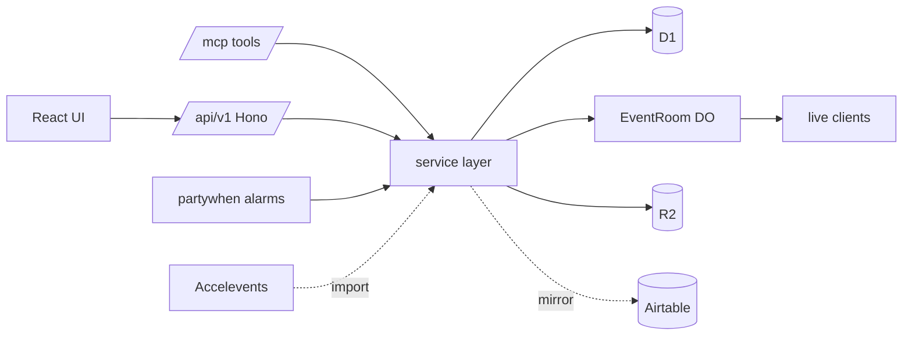

# session-party — Build Plan

Open-source Sessionboard replacement for the "Kill My SaaS" competition.
**Deadline: Wed Aug 12, 10PM PT.** Prize criteria: 9 core features, judged walkthrough, tiebreaker on product judgment. Bonuses: Cloudflare infra, Airtable persistence, speed, API.

## Product references

- Feature rubric: competition brief (9 features, screenshots of Sessionboard).
- **UX reference: [luma.com](https://luma.com)** — generous whitespace, one accent color, large rounded cards, soft shadows, minimal chrome, delightful empty states, event-page-first design. We clone Sessionboard's *capabilities* with Luma's *feel*.
- API shape reference: https://sessionboard.mintlify.app (bonus points for API parity in spirit).

## Stack (locked — do not relitigate)

| Layer | Choice |
|---|---|
| Runtime | Cloudflare Workers (single Worker) |
| Frontend | React 19 + Vite + `@cloudflare/vite-plugin`, file-based routes via `import.meta.glob` |
| HTTP API | Hono, mounted at `/api/v1`, `effect/Schema`-validated, OpenAPI emitted from tool/route metadata |
| Server style | **Effect v3 everywhere server-side**: `effect/Schema` at every ingress, `Data.TaggedError` error channel (`contracts/errors.ts`), services via `Layer` (`Db`, `Mail`, `Files`, `Rooms`, `Ai`), adapters `runPromise` at the Hono/MCP/WS boundary. Client stays plain React. |
| **MCP server** | `/mcp` endpoint on the same Worker (streamable HTTP, Cloudflare `agents`/`mcp` SDK). Tools call the same service layer as REST. |
| Realtime | PartyServer (`cloudflare/partykit`): one `EventRoom` Durable Object class, one instance per event |
| DB | D1 + Drizzle (source of truth). One-way mirror → Airtable (bonus). One-way import ← Accelevents. |
| Files | R2 (headshots, slides, docs) |
| Email | Resend; `.ics` attachments for calendar invites; `partywhen` (DO alarms) for scheduled reminders |
| AI review | Workers AI (optional assist pass) |
| Auth | Magic-link email for speakers/reviewers; session cookie; admin role on event membership |
| Tooling | pnpm, Node 24, TypeScript strict, vitest + `@cloudflare/vitest-pool-workers` |

## Why MCP + API twin transport

Every domain operation is implemented ONCE in a slice's `service.ts`, then exposed twice:

1. REST route (`features/<slice>/api.ts`) — for the UI, the public API bonus, and judges.
2. MCP tool (`features/<slice>/tools.ts`) — so agents (and Justin) can drive the app conversationally: create events, submit test CFPs, score, schedule, and verify — the dev/test loop IS the MCP server. Agents building slice N test it through MCP without touching the UI.



## Parallelization model: contract-first, partitioned ownership

Massive agent concurrency fails on shared files, not on shared ideas. Rules:

1. **Phase 0 freezes the spine** (contracts, schema, UI kit, registries). After freeze, only the integrator (main session) edits `contracts/`, `src/ui/`, root configs, and migrations.
2. **Exclusive directory ownership.** A slice agent writes ONLY inside `src/features/<slice>/` (+ its own tests). Zero central-file edits.
3. **Registration by convention, not by editing shared files:**
   - API: `features/*/api.ts` default-exports a Hono router; a codegen script (`pnpm gen`) writes `src/server/registry.gen.ts`. Agents never touch it — regenerate deterministically at integration.
   - Client routes: `features/*/routes/**/*.tsx` picked up by `import.meta.glob` — adding a page is adding a file.
   - MCP tools: `features/*/tools.ts` exports `ToolDef[]`, same codegen.
   - Realtime: messages namespaced `"<slice>/<type>"`; `features/*/party.ts` exports handlers keyed by prefix. `EventRoom` dispatches by prefix — no central switch statement.
4. **Schema is frozen data, not shared code.** The full domain schema ships in Phase 0 (below). Slices write queries against it; they NEVER add migrations. Schema gaps → message the integrator, who lands a migration and bumps `contracts/`.
5. **UI is consumed, never forked.** Slices import from `@/ui` only. No new global CSS, no new design tokens, no second button.

### Scale topology ("hundreds of agents")

Honest math: this session runs ≤8 concurrent subagents. Hundreds = a tree, and it's the right shape anyway:

- **Integrator (this session):** owns contracts, merges, resolves cross-slice questions on IRC/hub.
- **~10 slice leads** (Paseo agents or task subagents, worktree-isolated): own one feature slice end to end.
- **Each lead fans out internally** (schema-query writer, route builder, tests, polish) — 5–10 subtasks per slice ⇒ 50–100+ concurrent workers at peak without merge hell, because every leaf still writes only inside one slice directory.
- Worktree isolation (`isolated: true` / Paseo worktrees) + the ownership rule means merges are append-only. Conflicts can only occur in generated files, which we regenerate instead of merging.

## Repo layout

```
contracts/               # FROZEN after Phase 0 (integrator-only)
  schema.ts              # Drizzle schema — single source of truth
  types.ts               # zod schemas + inferred domain types
  protocol.ts            # realtime message types: "<slice>/<type>" unions
  routes.ts              # API path constants + client route paths
  mcp.ts                 # ToolDef type, tool naming convention
migrations/              # integrator-only (drizzle-kit output)
src/
  server/
    index.ts             # Worker entry: Hono app, /mcp, static assets, DO export
    registry.gen.ts      # GENERATED — api routers, tools, party handlers
    party/EventRoom.ts   # PartyServer DO: auth, presence, prefix dispatch
    auth.ts  db.ts  mail.ts  storage.ts   # shared infra (Phase 0)
  ui/                    # FROZEN kit: tokens.css + components (Luma-flavored)
  client/                # app shell, router glue, PartySocket hook, api client
  features/
    <slice>/
      api.ts service.ts tools.ts queries.ts    # server side
      party.ts?                                # realtime handlers (if any)
      routes/*.tsx components/                 # client side
      <slice>.test.ts
scripts/gen.ts           # scans features/, emits registry.gen.ts
seed/                    # demo event, speakers, submissions (Phase 2)
PLAN.md  AGENTS.md  wrangler.jsonc  vite.config.ts  drizzle.config.ts
```

## Schema (Phase 0, frozen)

`users`, `sessions_auth` (magic-link tokens), `events`, `event_members` (role: owner/admin/reviewer),
`forms` (kind: cfp/task), `form_fields` (type, options, `logic` JSON: show-if rules, category routing),
`submissions` (status pipeline: submitted → in_review → accepted/rejected/waitlist), `submission_answers`,
`speakers` (profile: bio, headshot R2 key, links), `submission_speakers`,
`review_rounds`, `review_assignments`, `reviews` (score, comment, `ai` flag),
`tracks`, `rooms`, `sessions` (talk: title, start/end, room_id, track_id, status), `session_speakers`,
`tasks` (per-event onboarding checklist def), `task_completions` (per speaker, drives dashboard),
`email_templates`, `email_sends` (log + scheduled via partywhen), `pages` (wiki/resources, html embed),
`assets` (R2 metadata), `integrations` (airtable/accelevents config + cursors), `api_keys`.

## Realtime protocol (Phase 0, frozen)

One room per event: `EventRoom:<eventId>`. Envelope `{ t: "<slice>/<type>", ...payload }`, server-authoritative:
- `agenda/*` — session moved/created/deleted, conflict set recomputed server-side, presence cursors
- `dashboard/*` — task_completion changed, speaker progress delta
- `review/*` — score submitted, reviewer presence
- `submissions/*` — new submission toast

## Phases

### Phase 0 — Spine (serial, integrator, ~half day)
1. Scaffold: pnpm workspace-less single app, wrangler.jsonc (D1, R2, DO, assets, vars), Vite+React, Hono `/api/v1` + `/mcp`, vitest.
2. `contracts/` complete: schema + migration 0001, types, protocol, routes, ToolDef.
3. Infra modules: auth (magic link + cookie), db, mail (Resend+ics), storage (R2 presign).
4. `EventRoom` DO with prefix dispatch + presence.
5. UI kit: tokens (Luma-flavored), ~15 components (Button, Input, Select, Card, Modal, Sheet, Tag, Avatar, Table, Tabs, EmptyState, Toast, DatePicker, Dropzone, Skeleton), app shell (sidebar nav per event, topbar).
6. `scripts/gen.ts` + one example slice (`events`: CRUD) proving the whole pipe: route → service → tool → test.
7. CI: typecheck + vitest + `pnpm gen --check`. Deploy once to Cloudflare (empty shell live from day 1).
**FREEZE. Tag `spine-v1`.**

### Phase 1 — Parallel slices (the fan-out)

| # | Slice | Brief feature | Realtime | Key MCP tools |
|---|---|---|---|---|
| 1 | `forms` | #1 CFP builder: field editor, conditional logic, category routing | — | `create_form`, `add_field`, `set_logic` |
| 2 | `submit` | #1 public CFP page (no-auth, mobile) | `submissions/new` | `submit_cfp` |
| 3 | `portal` | #2, #8 speaker portal: profile, uploads, tasks, resources/wiki + HTML embeds | emits `dashboard/*` | `get_speaker_status`, `complete_task` |
| 4 | `comms` | #3 templates, merge fields, scheduled reminders, ICS calendar invites | — | `send_email`, `schedule_reminder`, `preview_template` |
| 5 | `review` | #4 rounds, assignments, scoring, AI-assist pass | `review/*` | `assign_reviewers`, `score`, `ai_review` |
| 6 | `agenda` | #5 drag-drop builder, conflict detection, list/day/week/track/room views | `agenda/*` (flagship demo) | `schedule_session`, `detect_conflicts` |
| 7 | `dashboard` | #6 live onboarding status board | `dashboard/*` consumer | `get_outstanding_tasks` |
| 8 | `integrations` | #7 Accelevents one-way import + Airtable mirror | — | `sync_accelevents`, `mirror_airtable` |
| 9 | `embed` | #9 public speaker gallery + schedule (iframe/web-component, edge-cached) | — | — |
| 10 | `home` | Event settings, member management, landing (Luma-style event card) | — | `create_event` |

Slice-lead brief template (every dispatch carries this):
> Own `src/features/<slice>/` exclusively. Import contracts from `contracts/*`, UI from `@/ui`, infra from `src/server/{auth,db,mail,storage}`. Never edit shared files or migrations; schema gaps → hub message to Main. Implement service.ts first, then api.ts + tools.ts (thin), then routes/. Test via MCP tool calls against local dev. Skip formatters/lint/full suite — integrator runs them.

### Phase 2 — Integration & judging polish (serial-ish, 1 day buffer)
- Regenerate registries, run full typecheck/tests, fix seams.
- `seed/`: realistic demo event ("AI Engineer Sandbox"), 30 speakers, 60 submissions — judges must land in a *full* app.
- Walkthrough pass mirroring the brief's video: every one of the 9 features exercised.
- Perf pass (bonus): edge-cache embeds, no waterfalls, cold-start audit.
- Deploy, custom domain, README, submission form.

## Verification loop

- Each slice: vitest against workers pool + at least one MCP-driven end-to-end call.
- Integrator smoke: scripted MCP sequence — create event → publish CFP → submit → review → accept → task portal → schedule → embed renders. That script is also the demo script.

## Intel from Discord (updates, ranked by impact)

- **Admin UI is the mandatory deliverable**; chat/agentic interfaces are explicitly bonus. MCP remains our test harness + API bonus — it must never steal time from the organizer UI.
- **Don't blindly clone the screenshots** — organizer expects synthesized flows that streamline real event ops. Luma-style UX is the differentiator, not screen parity.
- **Airtable emphasis is strong** (possibly primary persistence in organizer's mind). Decision stands: D1 truth (participants already flagged Airtable-as-primary perf risk), but the Airtable mirror must be demo-visible. Re-check after Sunday clarification video; requirements FREEZE after it.
- **Open questions awaiting organizer clarification** (build the cheap answer, keep the door open): `.ics` attachment vs native calendar API (build .ics); single CFP form with routing vs per-track forms (schema supports both); speaker edit-after-accept (portal: editable, per-event toggle); co-speaker accounts (supported via submission_speakers).
- **Budget: $500 hard cap incl. subscriptions** — favor cheap models for mechanical subtasks, track usage.
- **Decision: USE EFFECT (user call, locked).** Server-side is Effect v3: Schema for validation, tagged errors, Layer-provided services. Anti-hallucination mitigation: the spine's `events` slice is the canonical pattern — slice agents copy it, never invent Effect idioms; the slice brief forbids APIs not demonstrated there or in the Effect docs snapshot.
