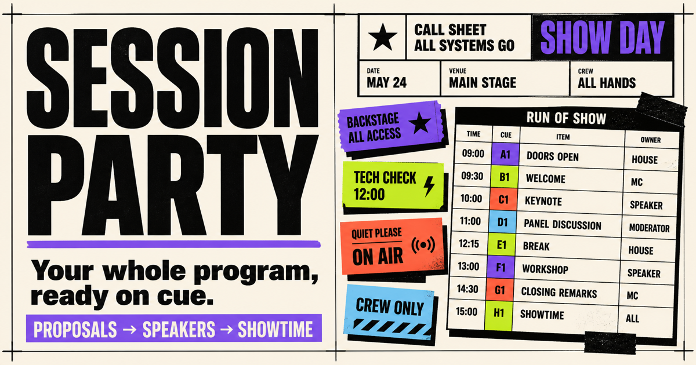
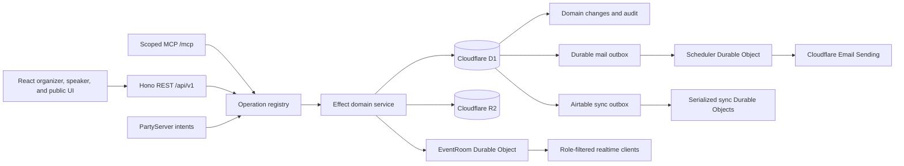

<p align="center">
  
</p>

<h1 align="center">Session Party</h1>

<p align="center">
  An open-source event-production workspace for turning proposals into a published run of show.
</p>

<p align="center">
  <a href="https://sessionparty.com">Live demo</a> ·
  <a href="#self-host-on-cloudflare">Self-host</a> ·
  <a href="#local-development">Local development</a> ·
  <a href="PLAN.md">Architecture plan</a> ·
  <a href="LICENSE">MIT license</a>
</p>

Session Party is a Cloudflare-native alternative to Sessionboard for conference and event teams. It keeps calls for proposals, committee review, speaker readiness, agenda planning, communications, and public program publishing in one connected workflow.

The primary product is the organizer workspace. Speakers get a focused portal for their profile, tasks, forms, files, and event resources; attendees get mobile-friendly speaker and schedule pages. REST, MCP, and realtime transports support automation without replacing the human workflow.

> Session Party is under active pre-1.0 development. The hosted demo is suitable for evaluation, but APIs and schemas may still change.

## Try the demo

Open [sessionparty.com/login](https://sessionparty.com/login) and choose one of the synthetic demo roles:

- **Organizer** — manage the event, review pipeline, speakers, agenda, communications, publication, and integrations.
- **Reviewer** — score proposals and participate in the private committee conversation.
- **Speaker** — maintain a profile, complete onboarding tasks and forms, upload materials, and read event resources.

The demo identities exercise the normal authorization paths without requiring access to an email inbox. Integration fixtures and local mail captures are labeled; they are not presented as live provider activity.

## What it does

### Collect routed proposals

- Build typed CFP and task forms without writing code.
- Add conditional questions and route every primary-CFP option to a program category.
- Publish immutable form versions so historical answers keep their original meaning.
- Accept anonymous public submissions with abuse controls, then let speakers claim and edit their work through passwordless sign-in.

### Review and decide

- Run ordered review rounds with configurable rubrics and optional reviewer assignments.
- Give the event committee one private, append-only conversation per proposal.
- Keep AI suggestions labeled and non-authoritative; a human must save the final score or decision.
- Accept, reject, or revoke acceptance with version and idempotency checks.

### Prepare speakers

- Provision accepted speakers into a dedicated portal.
- Track profile, confirmation, form, headshot, slides, and supporting-document readiness.
- Create event tasks and resource/wiki pages, including allowlisted embedded content.
- Give organizers an aggregate readiness dashboard, directory, and explicit contact history.

### Reuse work across editions

- Let private-installation staff support every event without adding fake per-event memberships.
- Search a browser-only speaker directory across prior events, then invite a returning speaker into a new event without sending mail or accepting on their behalf.
- Preview and copy an owner/admin/reviewer team between events while preserving existing target roles.
- Clone an event into a private, unpublished next edition with draft forms, pending review rounds, task templates, resource pages, tracks, rooms, and message templates—but no proposals, reviews, decisions, speakers, agenda/publication state, deliveries, credentials, or integrations.

See [Recurring events and install staff](docs/recurring-events.md) for the authority model and the exact clone boundary.

### Build and run the agenda

- Draft talks with room, track, or time left as TBD.
- Save overlapping work while surfacing room and speaker conflicts as named warnings.
- Publish only when every active talk is complete and conflict-free.
- Coordinate agenda focus, soft locks, cues, timers, holds, and show state in realtime.

### Communicate deliberately

- Preview personalized text and HTML before sending.
- Require an explicit organizer action before a campaign enters the durable outbox.
- Attach calendar invitations generated from the confirmed published agenda.
- Preserve immutable message snapshots, retry evidence, provider receipts, and dead-letter state with honest at-least-once delivery semantics.

### Publish and integrate

- Publish immutable public-program revisions with responsive session, speaker, agenda, gallery, and itinerary views.
- Generate configurable schedule and speaker embeds, public JSON endpoints, and downloadable `.ics` calendars.
- Import Accelevents speakers and talks through an idempotent production adapter interface.
- Optionally synchronize selected Airtable fields with explicit per-field authority and visible conflict state.
- Export the event's durable institutional record as JSON.

## Architecture

Session Party runs as one Cloudflare Worker application. A shared operation definition owns validation, authorization, business logic, and transport metadata; generated adapters expose the same operation through the transports it supports.



Core choices:

- **Application:** TypeScript, React 19, Vite, React Router, Tailwind CSS 4
- **Server:** Cloudflare Workers, Hono, Effect v3, `effect/Schema`
- **Data:** D1, Drizzle ORM, R2
- **Realtime and scheduling:** PartyServer and Durable Objects
- **Automation:** event-scoped API keys, Streamable HTTP MCP, generated OpenAPI 3.1 contracts
- **Testing:** Vitest in the Workers runtime, Storybook browser tests, Playwright, and visual regression checks

Correctness is part of the product design:

- External input and output are schema-validated.
- Event membership or an exact event-scoped API-key permission is checked at every protected boundary.
- Retryable commands use idempotency keys; versioned mutations use optimistic concurrency.
- Draft agenda edits never alter the current immutable public revision.
- Party messages are post-commit hints, while D1 remains canonical.
- Bearer credentials are hashed, uploads are ownership-checked and allowlisted, and realtime delivery is audience-filtered.

See [PLAN.md](PLAN.md) for the authoritative architecture, security model, scope, and implementation decisions.

## Self-host on Cloudflare

[](https://deploy.workers.cloudflare.com/?url=https://github.com/jpoehnelt/session-party)

The deploy flow copies this repository into your GitHub or GitLab account, provisions the Worker, D1 database, R2 bucket, Durable Objects, and Workers AI binding, applies database migrations, and enables deployments from your new repository.

### Before you deploy

Session Party uses passwordless email for sign-in and Turnstile for public proposal forms. In the Cloudflare account that will own the installation:

1. Add the domain to Cloudflare.
2. [Onboard its sending domain to Cloudflare Email Service](https://developers.cloudflare.com/email-service/get-started/).
3. [Create a Turnstile widget](https://developers.cloudflare.com/turnstile/get-started/) for the hostname you plan to use.

Review these values in the deployment form:

| Setting | Value |
|---|---|
| `APP_URL` | The final origin, for example `https://events.example.com` |
| `INITIAL_ADMIN_EMAIL` | Your email address; this closes public registration |
| `MAIL_FROM` | A sender on the onboarded domain, for example `Session Party <welcome@example.com>` |
| `POSTHOG_KEY` / `POSTHOG_HOST` | Optional analytics settings. Leave both blank to send no product analytics. |
| `SESSION_SECRET` | A unique value generated with `openssl rand -hex 32` |
| `INTERNAL_SERVICE_SECRET` | Optional dedicated Worker-to-Durable-Object bearer generated with `openssl rand -hex 32`; until provisioned, a one-way domain-separated token is derived from `SESSION_SECRET` so the session key is never transmitted |
| `TURNSTILE_SITE_KEY` | The widget's site key |
| `TURNSTILE_SECRET` | The widget's secret key |
| `TURNSTILE_HOSTNAMES` | The final hostname, for example `events.example.com` |

Keep `INITIAL_ADMIN_EMAIL` set for a private installation. That address can sign in, receives install-wide staff authority, and can create the first event; reviewer invitations and managed-speaker onboarding remain available without opening public registration. Leaving it blank enables open registration and deliberately disables install-wide staff grants.

### Connect the domain

After the first deployment:

1. Open **Workers & Pages** in Cloudflare and select the new Worker.
2. Go to **Settings → Domains & Routes → Add → Custom Domain**.
3. Enter the exact hostname used by `APP_URL` and `TURNSTILE_HOSTNAMES`.
4. Open the hostname, sign in with `INITIAL_ADMIN_EMAIL`, and create the first event.

Cloudflare creates the DNS record and certificate. Remove any existing CNAME for that hostname before attaching it.

### Pull-request previews

Repository pull-request previews are UI-only: they have no D1 or R2 bindings, cannot run scheduled jobs, and never apply remote migrations. API-backed preview workflows require separately provisioned preview storage and are intentionally disabled by the default template.

## Local development

### Prerequisites

- Node.js `24.11` or newer within major version 24
- pnpm `10.28.x`

Install dependencies, reset the local Cloudflare state, apply migrations, seed the deterministic demo, and start Vite:

```bash
pnpm install
pnpm dev:service
```

Open [http://127.0.0.1:5173](http://127.0.0.1:5173). The local environment uses Miniflare-backed D1, R2, and Durable Objects plus fake external adapters; it does not require production secrets.

After the initial reset, use `pnpm dev` to restart while preserving local state. To rebuild the deterministic dataset, stop the server and run `pnpm dev:service` again.

### Useful commands

| Command | Purpose |
|---|---|
| `pnpm dev:service` | Reset, migrate, seed, and start the local application |
| `pnpm dev` | Start the application while preserving local state |
| `pnpm check` | Check generated registry freshness and TypeScript projects |
| `pnpm test` | Run the Worker Vitest suite |
| `pnpm smoke:local` | Exercise local REST, MCP, D1, R2, and Durable Object bindings against a running server |
| `pnpm build` | Build the production Worker and client assets |
| `pnpm storybook` | Run the component and state laboratory |
| `pnpm ci` | Run the complete type, test, visual-tool, build, and Storybook gate |
| `pnpm gen` | Regenerate the feature registry after operation or route changes |

## Repository layout

```text
contracts/          Shared schemas, authorization policies, routes, and operation types
migrations/         D1 migrations
src/features/       Feature-owned domain services, operations, routes, and components
src/server/         Worker composition, transport adapters, auth, Durable Objects, and sync
src/client/         React application shell, routing, auth, API, and realtime clients
src/ui/             Shared UI primitives and composites
scripts/            Local reset, seed, smoke, demo hydration, and promotion tools
docs/               Brand and visual-regression documentation
```

Feature modules own their domain logic and declare their routes and transports. `pnpm gen` projects those declarations into `src/server/registry.gen.ts`; do not edit that generated file by hand.

## Production deployment

Self-hosting requires a Cloudflare account and project-owned D1, R2, Durable Object, Workers AI, Turnstile, and Email Sending resources. The deploy button provisions the supported resources and rewrites their binding identifiers in the copied repository.

Production requires `SESSION_SECRET` and `TURNSTILE_SECRET`. Set `INTERNAL_SERVICE_SECRET` for independently rotatable internal authorization; deployments without it safely derive a separate internal token from `SESSION_SECRET`. Live Accelevents and Airtable integrations additionally use `ACCELEVENTS_API_TOKEN` and `AIRTABLE_PAT`; those provider secrets are never accepted from the browser.

Product analytics are off by default for self-hosted installations. Set both `POSTHOG_KEY` and `POSTHOG_HOST` only if the installation owner explicitly wants PostHog collection; partial or invalid settings keep analytics disabled.

After reviewing the target bindings and migration plan:

```bash
pnpm deploy
```

`pnpm deploy` builds the application, applies pending migrations through the `DB` binding, and deploys the Worker. The repository's CI workflow performs the same migration and deployment sequence only after the complete gate succeeds on `main`.

## License

Session Party is available under the [MIT License](LICENSE).
